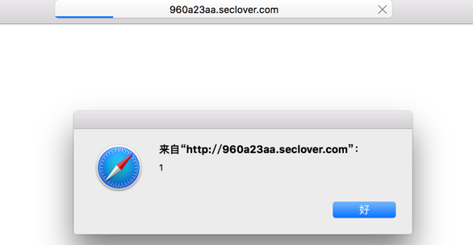

###前言
由于带着对Web安全对兴趣，前几天和网友们一起参加SSCTF玩, 显然我负责Web。
初步看了一下题，第一题得考上传，第二道是XSS:[题目链接](http://960a23aa.seclover.com/index.php)，第三道是SQLinject.
XSS居然过滤那么多标签和关键字，SQLinject发现DB是NoSQL中的mongodb.
然后从来没参加这种比赛的我蒙蔽了,当时大概是这样的：

好吧，我不会。
然后我转去解Crypto的题的时候，这时候队友给了我一个链接：

[不需要html标签的XSS](https://www.92aq.com/2016/01/28/angularjs.html)

卧槽，如获至宝呀！涨知识了。

###1.模版注入
---
先快速浏览了一下这篇文章，发现题目中和这个没啥区别，就是多过滤了点关键字呗，比如`on`替换成空了，试了一下`oonn`,哈哈,Get It！

然后简单构造:

    {{'a'.coonnstructor.prototype.charAt=[].join;		$evevalal('x=alalertert(1)');}}

于是成功了：

当然，我是来学习的，怎么能止步不前呢，于是我继续Google这方面的资料，发现这方面的东西真多：
 
 + 比如这篇文章：

> [Server-side-template-injection](http://blog.portswigger.net/2015/08/server-side-template-injection.html)

其PDF可以在这里发现:[Kettle-Server-Side-Template-Injection-RCE-For-The-Modern-Web-App-wp.pdf](https://www.blackhat.com/docs/us-15/materials/us-15-Kettle-Server-Side-Template-Injection-RCE-For-The-Modern-Web-App-wp.pdf)

 + [利用 Python 特性在 Jinja2 模板中执行任意代码](http://www.freebuf.com/articles/system/97146.html)
 
以上满满地都是干货。 

###2.Python的decode/encode
---

这是这次比赛获得到的第二个技能点

比赛结束之时，队友在群里问：

> Happy(\*\*\*)  14:37:52
>
> //three encryption
> 
> code="K0FDTUFRQUIrQUY0QVJBQkJBRUVBUVFCQkFFRUFQUUE5QUZZQWZ3QllBR0FBVXdBckFEZ0FiUUFoQUhNQVl3QXBBR2NBWndCUkFFRUFRUUJCQUQwQVBRQmVBQ01BZmdCQS0="
> 第一次看出是base64，之后还有两次看不出来了
>
> 求大牛help
>
> 老虎<\*\*\*\>  14:48:29
>
> 你什么都试试呗
>
> <\*\*\*\>  14:50:03
>
> base64\-\-\>utf7\-\-\>vbscript.encode

然后关于UTF7我也恰好是看了的，只是最后一部不知道（^_^现在知道了）
我之所以提到Python的内置函数我才发现`encode`和`decode`是如此的牛逼：

    In [1]: code="K0FDTUFRQUIrQUY0QVJBQkJBRUVBUVFCQkFFRUFQUUE5QUZZQWZ3QllBR0FBVXdBckFEZ0FiUUFoQUhNQVl3QXBBR2NBWndCUkFFRUFRUUJCQUQwQVBRQmVBQ01BZmdCQS0="
 
    In [2]: code.decode('base64').decode('utf7')
    Out[2]: u'#@~^DAAAAA==V\x7fX`S+8m!sc)ggQAAA==^#~@'

枉费我用了那么久的的`encode/decode`,但是从来没想到可以直接`decode/encode`比如向`base64` /`zip`这样的编码方式！简直跪了！！！
这里去=>[了解更多](https://docs.python.org/2.7/library/codecs.html#standard-encodings)

之前的我只认为编码方式是什么utf7,8,16呀。gbk之类的可以，没想到。。。base64/zip也支持！

对了，至于说怎么知道是utf7的话，可以参见UTF7的wikipedia,从算法来看，如果一个字符串是中间有什么`+`或者`-`的话，可能性就有点高，可以试试用该编码方式哦。

###3.看文档！！！
---

无论是上面模版注入中的文档和Python官网提到的内容来看，都表示了要熟悉和了解这些漏洞和用法，必须仔细看文档。

这让我想到了这篇文章：
[php-date-is-xssable/](http://0xa.li/php-date-is-xssable/)

文中多次提到
> According to the documentation

**爱读文档的孩子真的会有收获的～（虽然脑洞得大）**

这段代码我觉得非常棒～

	:::php
	<?php
	echo date(‘<\i\m\g \s\r\c=x \o\n\e\r\r\o\r=\a\l\e\r\t(\’X\S\S\’)\>’);

说到这里，我吐槽一下前几天写PHP遇见的一个bug，我判断一个整数的时候用的代码如下：
    
    :::php
    <?php
    filter_var($input, FILTER_VALIDATE_INT) !==false ;
    
这个函数在32bit和64bit上效果是不一样的，`PHP_INT_MAX`范围不一样，整数范围就不同了。官方文旦没有这点，我找了半天才反应过来是这方面的问题～～～
哦，对了，天真的我在该函数中加入官方文档中提到的第三个可选参数`$options`以为可以扩大检查范围，实现32bit和64bit机器的一致性。

比如这样的 ：

    
    :::php
    <?php
    filter_var($input, FILTER_VALIDATE_INT, array('option'＝>array('max_range'=>PHP_INT_MAX+2)))) !==false ;

结果可想而知，这个max_range会被强制转为int,所以**溢出了**～～

2333333

全文结束，感谢阅读。

   
    

