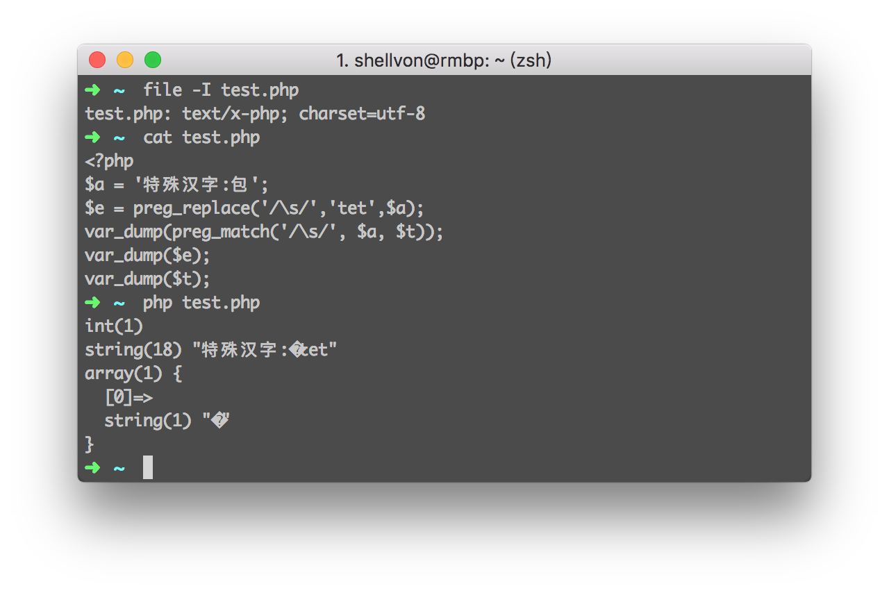

###前言
前几天我在给公司做内部项目的接口迁移时发现了某个比较有趣的bug：

环境:`PHP 5.6.19`和`PHP 5.5.30`

    :::php
    <?php
    $prejson = function($data)use(&$prejson, $en_json)
    {
        if (is_array($data)) {
            foreach ($data as $k=>$r) {
                $data[$k] = $prejson($r);
            }
            return $data;
        } else {
            $str = preg_replace("/\\s/isU"," ",$data);
            $str = str_replace("\\","\\\\",$str);
            $str = !$en_json ? str_replace('"','\"',$str) : urlencode(str_replace('"','\"',$str));
            return $str;
        }
    };

###Bug及其探究

看样子这个PHP的匿名函数主要是做的防止`json_encode`出来的中文被转义(低版本的`json_encode`函数不支持`JSON_UNESCAPED_UNICODE`)。
但是注意到其中`preg_replace`这里，有一个很细微的bug,关于`preg_replace`的。

如果需要替换的$data中含有某些比较**特殊**的汉字，那么这个转化出来的json可能会出现乱码，比如汉字`包`。

以下是测试结果：

但是为什么会出现这个结果呢？和我的电脑有关系么？我去了这里做了一下测试：

+ [https://3v4l.org/SijtS](https://3v4l.org/SijtS)
+ [https://3v4l.org/ltHtO](https://3v4l.org/ltHtO)

然后我在windows 10 64bit中XAMPP带的PHP执行，同样没有乱码，而且我保证我存的文件都是utf8的，`mb_internal_encodig`也是utf8.但是眼前的一切真的让我虎躯一震。我的电脑真的乱码了~~难道我电脑坏了，我试过了`iconv/mb_convert_encoding`都无济于事。心好累。
后来同学提示说说可不可能replace只替换了汉字包的一部分！！我说怎么可能？\s匹配的是whitespace空格呀，我汉字里面就是unicode编码也不会出现空格吧。

PHP官方文档上关于[转移字符](http://php.net/manual/en/regexp.reference.escape.php)说的是
> \s
>   any whitespace character

但是慢着，别慌。谁说whitespace就一定只有空格的呀？[维基百科](https://www.wikiwand.com/en/Whitespace_character)里面说的有那么多种！！
于是我把汉字`包`给转化成unicode需要显示的字

    encodeURIComponent('包') => "%E5%8C%85"

然后在维基百科种找到了`U+0085`	=> `next line`好吧，到这里一切都豁然开朗。

也就是我给了汉字`包`过去,对于`preg_match/preg_replace`这种函数，即使我字符串是utf8的，对于他得到的regex,会给我理解成`/[\xE5\x8C\x85]/`这种形式。所以\s匹配成功。。。。。

所以不仅仅是汉字`包`，其他汉字如果出现了\s中能匹配的Unicode，那么理论上也会被匹配掉呢。

但是为什么我在3v4l.org上和windows上都没出现乱码呢？我猜测和他们建立的regex不一样（但是不知道为什么会不一样) PHP7不一样估计是原生采用了unicode的方式。

###解决方法

1. 用PHP7吧！
2. 修改成mb_系列的函数。（和`mb_strlen/str_len`那种感觉类似）
3. 加上`u`这个flag:[http://php.net/manual/en/reference.pcre.pattern.modifiers.php](http://php.net/manual/en/reference.pcre.pattern.modifiers.php) (这下面别人的讨论其实就是我这次遇到的bug的解决方案！！！)

###扩展阅读：

+ [http://php.net/manual/en/regexp.reference.escape.php](http://php.net/manual/en/regexp.reference.escape.php)
+ [https://www.wikiwand.com/en/Whitespace_character](https://www.wikiwand.com/en/Whitespace_character)
+ [http://php.net/manual/en/reference.pcre.pattern.modifiers.php](http://php.net/manual/en/reference.pcre.pattern.modifiers.php)
+ [PHP preg_match and UTF-8](http://gynvael.coldwind.pl/?id=357)

