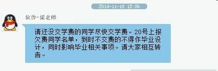

突然之间告诉我不交学费就无法参加毕业设计：

6k多啊~对于一下自诩穷屌的我显然没法拿出来这么多。虽然我是大四狗，还有一个实习工作，但我还是没有钱。
借钱的心酸就不说了，好不容易集齐那么多的钱然后缴费处告诉我他们去学习！19号暂停收费。。。。于是我19号白请一天假。
虽然20号我交钱了。也不知会不会光荣的加入大五。哎。大五，你好。虽然其实我有机会我还是愿意留在学校继续读书。但是我不想以这样的方式下去。

作为大四狗，每次回到学校，看到他们他们哭上课无聊什么的孩子，我意识到自己不再是一个学生。现在负债5k多，这下好了，我看到了更多的困难和孤独。大半年的工作经验告诉我，这钱真的太难以获取了。作为码农，我以为我的实习工作相当轻松/自由/随性，但是我没看到收入太低在这种突然缺钱的生活竟然让我如此落魄。

借钱给我的室友壕挺好，钱借给我之后，都得开始找工作了。不然觉得生活费不够。我也在想，我需不需要接外包试试？但是我最怕的一点是接了做不起。

很多人在这几天找我聊天的时候谈论到我应该继续留在成都。还是应该去一下帝都/魔都/杭州这些地方，因为这样或许可以给我带来更大的机会发展自己。

我不知道。

作为学渣，一方面我得想如何在寒假之前找到6k还钱，并且回到家里我能向村里人证明读出大学是有用的，至少我找到工作待遇也不差。另一方面我有过幻想外面的城市会是怎样，但是也清楚的认识到自己的差距---专业成绩不高，比如大多数公司招聘要求的CET4都没考过，专业技能什么都想去学-但无一精通。同时我自己也是相当胆小不敢尝试一个人去外地闯。依赖于别人太严重。

也许我该感谢学校的这个决定和我现在的工作，突然间让我如此落魄到认识生活的现状。

当初进入IT行业的时候，我不知道我适合和想学什么。所以我什么都去看看，什么都去学学。如今恍惚间4年【虽然严格意义上我大二之后才开始学的】，我依然没有找到目标，或者说是梦想？落的个浮躁的名字。

他们说这是应届毕业生的通病~他们说认识到不足很不错，但是没有改变的毅力还不是徒劳。

能不能毕业都不关心了。我究竟该如何面对我现在的不足然后去弥补它，还有怎么还钱【高薪一点的工作？】，让自己在IT或者生活的到路上走的更远呢。

文章只是为了测试中文混乱写一点。
